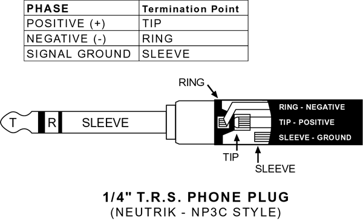

Kicad is used to create the schematic and layout.
# Power PCB
The Power PCB  monitors the voltage and current of a (North American's) home energy lines.  It is the bottom PCB of three PCBs that when combined provide Watt readings and send them over wireless to an mqtt broker.  The other PCBs include:  
* [The meter PCB](https://github.com/BitKnitting/Tisham_PCB_meter_atm90e26).  The meter PCB includes two atm90e26 energy monitor ICs that takes in the analog readings from the power PCB and converts them into DC measurements a microcontroller can read.  
* [The microcontroller PCB](https://github.com/BitKnitting/Tisham_PCB_Feather).  The microcontroller PCB mounts a microcontroller with wifi - like a Feather RFM95 or a wemos D1 (a bit up in the air as of this date - 4/5/2019).  The microcontroller gets the voltage and current readings from the atm90e26's over SPI and then sends them via mqtt.

The three connect together to become the FitHome hardware.

# Thanks to Those That Went Before
This project extends [Tisham Dhar's work on building energy monitors using an atm90e26](https://github.com/whatnick/DIN_Rail_EnergyMonitor).  In particular, [the DIN Rail energy monitor](https://www.crowdsupply.com/whatnick/atm90e26-energy-monitor-kits).  Besides his open source projects, Tisham has been exceptionally helpful and supportive.  Tisham continues to inspire me.  THANK YOU.

Before I took [Chris Gammell's Contextual Electronics course](https://contextualelectronics.com/), I had absolutely no experience with electronics or building PCBs.  Chris is exceptional in so many ways.  THANK YOU.

There is an exceptional community behind [the OpenEnergyMonitor project](https://learn.openenergymonitor.org/).  They not only provide energy monitoring solutions, but are a wealth of knowledge.  THANK YOU.

# Background Info
 ## Electricity Coming Into Our Homes
 In our North American homes, 120V of electricity comes in through two power lines (L0 and L1).  A third line (N) acts as the reference point (analog ground) for voltage/current measurements.
 
 _Image from [here](https://learn.openenergymonitor.org/electricity-monitoring/ac-power-theory/use-in-north-america)_  

 See the section in the schematic labelled _Incoming 120V_.  
 ### Surges
 The MOVs(Metal Oxide Varistors - RV1, RV2, and RV3 on the schematic) clamp down on the voltage coming in when there are power surges.  Most of the time, voltage in North American homes oscillates from 0 to a peak voltage of 169 volts.  Sometimes this oscillation is disturbed by a spike in voltage caused by a lightning strike or  switching in the power grid:  
   
 # Voltage Sampling
 The Open Energy Monitor project has [great info](https://learn.openenergymonitor.org/electricity-monitoring/voltage-sensing/measuring-voltage-with-an-acac-power-adapter) on the how and the what of voltage sampling.  See the Voltage Sampling section of the schematic.

 Four resistors are run in series to ensure if any one of the resistors breaks down, the full 120V won’t be sent to the rest of the circuit.  Also, the resistors are rated to handle the incoming voltage (in my case 120V…but to be safe probably 240V rated resistors are a better thing to use). 
 
Noted in the atm90e26's datasheet: The pins that are for voltage sampling (15 and 16): _…are differential inputs for voltage. Input range is 120μVrms~600mVrms…_ 

Looking at the voltage divider formula:
  
R1 = 220K * 4 = 880K
R2 = 1K
Vin = 120V
Vout = 120(1/889)= 135mV.
# DC Power 
The atm90e26's and the microcontrollers need 3.3V DC power to work.  Since we have 120V coming in, we can transform it to provide the 3.3V DC power.  See the 120VAC -> 5 and 3.3VDC section in the schematic.  There are three pieces to the conversion:  
* The 120VAC -> 5VDC [SMPS](https://en.wikipedia.org/wiki/Switched-mode_power_supply).  
* The two LDOs.  The signal coming out of the SMPS is too noisy.  The LDOs clean up the signal.  
* The DC-DC isolator. This isolates the power for the atm90e26s from the power for the microcontroller.
# Current Sampling
See the Current Sampling section of the Kicad schematic.
## Current Transformers
 Two Current Transformers (CTs) are needed to get current readings on the two 120V lines.   
   

 One CT is clamped onto the L0 line.  The other is clamped onto the L1 line.  Because the CT clamps onto the line, you might hear a CT refered to as a current clamp.  

 
 The CTs use a [TRS 3.5mm audio jack](https://www.cui.com/product/resource/sj-352x-smt-series.pdf) as the connector.
 ## Characteristics of the CT
 The characteristics of a CT to be considered when sourcing include:
 * The amount of Amp Service.  [From this article _Understanding Your Home's Electrical Load_](https://www.bhg.com/home-improvement/electrical/how-to-check-your-homes-electrical-capacity/) _Different homes need different amp services. A 60-amp service is probably inadequate for a modern home. A 100-amp service is good for a home of less than 3,000 square feet that does not have central air-conditioning or electric heat. A home larger than 2,000 square feet that has central air-conditioning or electric heat probably needs a 200-amp service._  According to [Bill Thompson of the Open Energy Monitor Project](https://community.openenergymonitor.org/t/ct-hole-diameter-for-north-america/5149), _US homes built before the late 60s were wired with Copper and typically had 100 Amp service, which used AWG 0 copper...Sometime in the late 60s to early 70s, Copper Service Entrance Wires were replaced by Aluminum. Since Aluminum has more resistance per foot than Copper, the equivalent Aluminum wire is two gauges larger than its Copper counterpart. About that same time, 200 Amp service became the norm._  
 * The wire gauge.  The Outside Diameter of the wire gauge determines how large the diameter of the CT clamp must be.  As Bill noted, wires could be copper or aluminum, or copper-clad aluminum.  More aluminum, more current - the wider the diameter.  
   * [100 Amp Service uses 1/0 AWG](https://community.openenergymonitor.org/t/ct-hole-diameter-for-north-america/5149/3) = [12.08 mm](https://lugsdirect.com/Wire_Insulation_Outside_Diameter_Thickness_600V.html).  
   * 200 Amp Service uses (up to?) 2/0 - 4/0 AWG.  [4/0 AWG has an Outside diameter of 16.04mm](https://lugsdirect.com/Wire_Insulation_Outside_Diameter_Thickness_600V.html).  
* Whether the burden resistor is included.  This design assumes the CT __does not__ include the burden resistor.  I.e.: it's output is a current and not a voltage.  
* The Amplitude of the secondary current.  Depending on the number of coils/turns on the secondary,  

A CT might output AC current at different amplitudes.  For example, if the home has 200A service and the secondary has 3,000 coils, the Amplitude is 200/3000 = 66.7mA.  If the same CT was used on a home with 100A service, the Amplitude would be 100/3000, or 33.3mA
#### Popular 100 Amp CT
The [YHDC SCT-013-000 Current Transform](https://learn.openenergymonitor.org/electricity-monitoring/ct-sensors/yhdc-sct-013-000-ct-sensor-report) is popular for houses with 100 Amp Service.  It's Outside Diameter is (as the name suggests) 13mm.  So it will be able to clamp around 100 Amp Service houses in North America.  The [YHDC SCT-013-000 datasheet](http://statics3.seeedstudio.com/assets/file/bazaar/product/101990029-SCT-013-000-Datasheet.pdf) notes the number of secondary coils is 1800.  At 100A, 100/1800 = 55.5mA, which is a bit higher than the maximum in the specification, but (I assume without really knowing) "close enough."

### 200A CT

The YHD SCT-013-000 can't be used on 200 Amp houses.  The clamp diameter of at least 16.04 mm.  And most likely it is better to have a different coil ratio for the secondary coils.

 ## Taking a Current Reading
 I first learned how the current reading circuit worked by reading [this excellent article on the OpenEnergyMonitor's site](https://learn.openenergymonitor.org/electricity-monitoring/ct-sensors/interface-with-arduino).  If you (like myself) are new to this stuff, it is worth a read.  

 If the CT outputs current, then a burden resistor is needed to convert to a Voltage to be read.  The readings can be negative.  To accomodate readings using the ADC of the Arduino as discussed in the project, a DC bias circuit of AREF/2 (2.5V) lifts ADC readings to be between 0 and AREF (5V).
 
 The atm90e26 does not need a DC bias circuit.  
 ### Burden Resistor
 Tisham's design uses a 12R burden resistor.  This is to accomodate the atm90e26's 600mV Vrms input limit.  The OpenEnergyMonitor's article noted the current output's Amplitude is .0707A.  Vpp = 0.0707*12 = 848mV.  The amplitude is then 424mV.  The Vrms = 424*sqrt(2) = 600mV.
 
 As Tisham noted: _In recent designs I have been splitting the 12R into 6R-6R and grounding the middle for signal symmetry._  This is why two 5.8R resistors are used.  I ran an LTSpice with:  
 *  a sine wave set at 60Hz with an amplitude of 0.0707A (from the OpenEnergyMonitor's Arduino article)
 * .tran 0 .1 0 .1
 
 # Connectors
 Getting connectors right has always been difficult for me.  The connectors used in the Power PCB include:  
 ## J1
 This is a plug in Terminal Block.  It connects the 120V power lines to the power PCB.
 The ones made by Phoenix Connect:  
 The male contact - [PN 1759059](https://media.digikey.com/pdf/Data%20Sheets/Phoenix%20Contact%20PDFs/1759059.pdf) is soldered to the power PCB.
 
 The female contact - [PN 1757051](https://media.digikey.com/pdf/Data%20Sheets/Phoenix%20Contact%20PDFs/1757051.pdf) plugs into the male contact and screws the wires into one of the 6 positions.  

 The prices for one of these connectors was WAY TOO HIGH. It appears there is a "clone" version that costs far less but is basically the same thing as the ones made by Phoenix Connect.  From an Alibaba quote:  
 ```
 1757051------MX2EDGK-5.08-6P-14------100PCS------0.36USD/PCS 
 1759059------MX2EDGR-5.08-6P-14------100PCS------0.12USD/PCS 
 ```
 ###  MX2EDGR-5.08-6P  
 This is the 6 position male piece.  The pins are at a right angle to the rest of the connection.  I noticed some vendors used MX2EDGRC (i.e.: added a C to the end).
 ###  MX2EDGK-5.08-6P  
 This is the female part that connects into the male part.  It has the screw downs for the power lines (like those in a power cord).
 I noticed the quote used different part numbers:
 ```
 MX2EDGK-5.08-6P-14  

 MX2EDGR-5.08-6P-14  
 ```
 #### First Order
These say they meet an Amp amount of 15A.   I ended up ordering 10 for a female/male at about $1.60 each.  Clearly this can come down significantly.  Right now, in prototype, we're fine with [the ones ordered on newegg](https://www.newegg.com/Product/Product.aspx?Item=9SIAHBU8RD2627).  
   
 __OOPS!__ The male pieces are not at right angles.  I need to be more careful and order by part number.
 __TBD:__ Not ordering any more at this point.  Query Alibaba.com for MX2EDGR.
 
 ## U1 and U2
 These are [the female 3.5 TRS audio part (SJ-3523-SMT-TR)](https://www.cui.com/product/resource/sj-352x-smt-series.pdf). The male audio jack on the end of each current clamp is inserted.
   
 ## J2
 The pin out for the [36 position female PCI Express connector](https://www.amphenol-icc.com/media/wysiwyg/files/drawing/10018784.pdf) that connects the meter PCB to the power PCB.  
 .  
 

